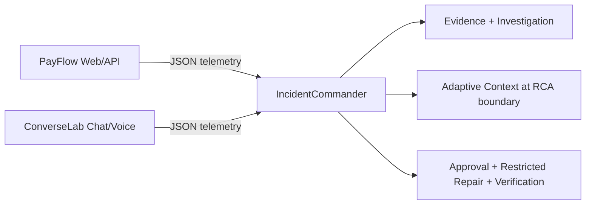
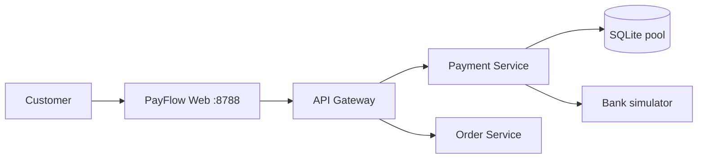
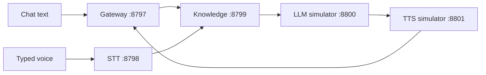
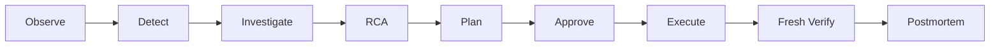
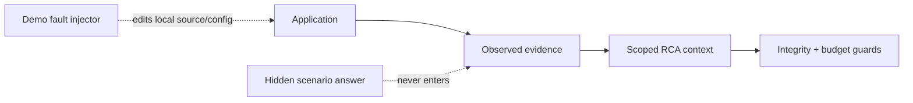

# IncidentCommander AI architecture

## 1. Executive Overview

IncidentCommander is a local AIOps control plane for two independent demo applications: PayFlow and ConverseLab. It observes real localhost HTTP traffic, correlates evidence, forms an evidence-backed RCA, proposes a restricted repair, requires human approval, executes only registered changes, and verifies recovery with fresh requests.

## 2. Problem Statement

Modern services fail across code, configuration and dependencies. Operators need a bounded investigation that explains what failed, why, what evidence supports it, what action is safe, and whether recovery is real.

## 3. Design Goals

Application-scoped evidence, deterministic safety controls, visible provenance, human approval, fresh verification, honest provider status, and a judge-friendly local demonstration.

## 4. Non-Goals

This is not a production orchestrator, arbitrary shell agent, live banking system, production speech platform, Kubernetes operator, or guarantee of zero hallucinations.

## 5. Three-Application Ecosystem

Commander (8787) monitors PayFlow (8788 gateway) and ConverseLab (8797 gateway). The applications keep their ordinary JSON APIs and telemetry. Only Commander’s LLM-facing context boundary evaluates JSON, TOON and HYBRID.

## 6. IncidentCommander Architecture

`commander.py` serves the UI and application-scoped API routes. `response_engine.py` owns the lifecycle. `application.py` defines the adapter contract. `investigator.py` correlates normalized observations. `ai_reasoning.py` validates provider-shaped RCA output and invokes deterministic fallback when needed. `patch_safety.py` and `source_provider.py` enforce restricted execution.

## 7. PayFlow Architecture

PayFlow uses ports 8788 gateway, 8789 payment, 8790 bank and 8791 order when `IC_BASE_PORT=8787`. `/api/pay` creates a real local transaction path; `/health`, `/api/state` and `/api/telemetry` expose operational state. Trace IDs and structured events flow through the local services.

## 8. ConverseLab Architecture

The sixth listener is the conversation service on 8802. `/api/converse` accepts `channel=chat|voice`; `/health`, `/api/state` and `/api/telemetry` are local endpoints. STT, LLM and TTS are simulated providers; HTTP boundaries, spans and failures are real.

## 9. Application Adapter Architecture

`MonitoredApplication` carries identity, services, URL, UI metadata and scope. `ApplicationAdapter` defines evidence collection, health, probes, runbooks, RCA context, repair plans and verification. `PayFlowAdapter` and `ConverseLabAdapter` supply application-specific topology, evidence and repair capabilities.

## 10. Telemetry Architecture

Adapters collect bounded metrics, logs, traces, health, dependencies, database/config/source/deployment/runbook/history observations. Each record includes application scope and is persisted in the Commander runtime JSON store.

## 11. Incident Detection

The adapter’s telemetry and probe summaries trigger an UNKNOWN incident when bounded error/degradation thresholds are crossed. Scenario labels and expected answers remain in the demo lab boundary; investigation receives observations, not the hidden cause.

## 12. Investigation Orchestration

The lifecycle is shared: observe, detect, investigate, collect, correlate, RCA, plan, approve, execute, verify and document. Every state transition is emitted to the timeline and incident report.

## 13. Investigator/Collector Architecture

Collectors are deterministic HTTP/file/Git/database probes for metrics, logs, traces, health, dependencies, database, source/Git, deployment, configuration, runbooks and historical incidents. They are not independent LLM agents. LLM-facing reasoning is a separate bounded provider contract.

## 14. Evidence Model

Evidence fields are `id`, `incident_id`, `application_id`, `source_type`, `source_name`, `service`, `timestamp`, `summary`, `raw_reference`, `relevance` and `metadata`. Source types include METRIC, LOG, TRACE, HEALTH, DEPENDENCY, DATABASE, GIT, DEPLOYMENT, CONFIG, RUNBOOK and HISTORY.

## 15. Evidence Correlation

The investigator joins time windows, trace IDs, services, error codes, source changes, dependency probes and historical matches. Application and incident IDs are checked at every boundary.

## 16. RCA Architecture

The validated RCA contract contains a primary hypothesis, affected services, suspected change, supporting and contradicting evidence IDs, alternatives, eliminated hypotheses, recommended action, `requires_more_evidence`, and explanation. Unknown IDs are rejected by validation.

## 17. Evidence-ID Validation

Only IDs present in the collected incident evidence may be cited. The deterministic fallback and provider response validator reject invented IDs and preserve explicit refusal/failure status.

## 18. Evidence Strength

The displayed score is a heuristic evidence score, not statistical probability. It combines direct errors, metric/trace correlation, temporal alignment, source changes, dependency elimination, runbook/history matches and contradictions as implemented by the response engine.

## 19. Adaptive Context Intelligence

`ContextOptimizationRequest` carries a bounded payload, purpose, application/incident scope, policy and optional budget. `ContextOptimizationResult` records profile, candidates, selected strategy, integrity, budget, timings, fallback, tokenizer and delivery metadata.

## 20. JSON

The canonical reversible baseline. It is always measured and is the safe fallback.

## 21. TOON

The reference `@toon-format/toon` codec represents repetitive structured LLM context. It is never used by PayFlow/ConverseLab APIs or persistence.

## 22. HYBRID

The versioned reversible serializer keeps structured regions compact while retaining prose/source-diff content. It is measured independently and may lose to JSON or TOON.

## 23. AUTO Router

The router measures every candidate, rejects invalid round trips, applies minimum saving and complexity utility, and selects the highest valid utility. JSON wins when alternatives do not justify complexity.

## 24. Payload Profiler

The profiler measures bytes, tokens, object/array/depth counts, records, repeated-key overhead, uniformity, structural repetition, text/schema complexity and evidence-type distribution.

## 25. Token Measurement

`tokenizer.py` uses tiktoken with an explicit model mapping and labels the local reference tokenizer. UTF-8 fallback is marked as fallback; provider token counts are not claimed.

## 26. Evidence Integrity Guard

Canonical full structure/value/order comparison is combined with path-aware anchors for evidence IDs, incident/application IDs, services, traces, requests/conversations, error codes, SHAs, deployments, configs, dependencies, statuses, timestamps, paths, diffs and numeric metrics. Missing categories are N/A.

## 27. Round-Trip Guard

Every candidate is decoded and compared before selection. Corruption, parser errors or semantic changes invalidate the candidate.

## 28. Token Budget Guard

The guard subtracts system, schema/tool, reserved output and safety-margin reservations from a configured context limit. Unknown limits are displayed as NOT CONFIGURED; over-budget candidates cannot cross the provider boundary.

## 29. Secret Redaction

Copied context is sanitized for secret-like keys, bearer/API-token patterns and cross-application records. Audit evidence remains in the incident store; sanitized context is what may be prepared for a provider.

## 30. Safe Fallback

If an optimized candidate fails integrity, budget or serializer validation, the router records the rejection and chooses a valid candidate, normally JSON. Efficiency never overrides evidence correctness.

## 31. Incident Memory

Historical incidents and runbooks are shaped as provenance-bearing context records. Memory is measured once as a subset of final RCA context; it is not double-counted as a second provider call.

## 32. Live AI Provider Boundary

When configured, `ai_reasoning.py` sends the selected serialized context in one structured provider request while retaining schema/instructions. No credentials were configured for this acceptance run.

## 33. Deterministic Fallback

Without credentials, the system performs real profiling/serialization/validation and uses evidence-correlated deterministic reasoning. The UI says LIVE AI — NOT CONFIGURED.

## 34. Remediation Planning

Adapters propose registered source/config edits with expected hashes, restricted paths, validation and rollback metadata. Plans are not arbitrary model-generated commands.

## 35. Risk Engine

Risk is deterministic and tied to changed files, validation, scope and impact. Unsupported or stale changes are rejected.

## 36. Human Approval

The approval request binds application, incident, plan, revision and content hashes. No repair executes without approval.

## 37. Restricted Execution

The patch executor allows registered files and safe AST/config validation only. Imports, shell, filesystem traversal, indirect execution and secret paths are rejected.

## 38. Verification

PayFlow requires 18 fresh checkout requests, p95 below 500 ms, pool below 80%, and healthy database/bank. ConverseLab requires five fresh voice and three fresh chat requests, complete spans, p95 below 1800 ms and healthy dependencies.

## 39. Failed Verification

The incident remains open, records failed checks, and offers reinvestigation or a local escalation note. It is not marked resolved by a report-only action.

## 40. Copilot

Copilot answers are application-scoped, evidence-backed and include context optimization metadata for context-related questions. It does not expose hidden chain-of-thought.

## 41. Postmortem

Completed incidents produce a report containing evidence, RCA, repair, approval, verification and context optimization measurements.

## 42. Security Boundaries

Local sandbox only, no credentials required, no real money, no arbitrary shell, scoped writes, hash checks, safe paths and explicit simulated-provider labels.

## 43. Application Isolation

Every incident, evidence row, context operation, Copilot query and report is filtered by `application_id`. Tests cover cross-app evidence and optimization lookup rejection.

## 44. Demo Fault Injection Boundary

Demo controls edit the local PayFlow source/config or ConverseLab config. They do not pass `scenario`, expected RCA or expected repair into investigator evidence.

## 45. PayFlow Connection-Leak Sequence

Healthy `try/finally` cleanup is replaced by a registered bad source. Pool utilization rises, acquisition fails with DB_POOL_EXHAUSTED, independent database/bank probes remain useful, and Commander proposes restoring cleanup. Approval and 18 fresh requests prove recovery.

## 46. ConverseLab TTS-Failure Sequence

TTS availability is changed locally. STT, Knowledge and LLM spans remain successful while TTS returns HTTP 503 and voice delivery fails. The adapter proposes restoring the bounded config and verifies five voice plus three chat requests.

## 47. Data Flow

Application JSON → adapter normalization → incident store → context sanitization/profile → candidate measurements → validated RCA boundary → report/UI. Operational APIs never carry TOON.

## 48. Control Flow

## 49. API Overview

Commander exposes `/health`, `/api/applications`, `/api/state`, `/api/incidents`, `/api/context-optimization/incidents/<id>`, `/api/context-optimization/stats`, `/api/report`, `/api/tests` and approval/demo routes. PayFlow exposes `/health`, `/api/pay`, `/api/state`, `/api/telemetry`; ConverseLab exposes `/health`, `/api/converse`, `/api/state`, `/api/telemetry`, `/api/knowledge`.

## 50. Runtime / Ports

`python run.py` starts Commander 8787, PayFlow gateway 8788, PayFlow internal services 8789–8791 and ConverseLab 8797–8802. `IC_BASE_PORT`, `CL_BASE_PORT` and `IC_DATA_DIR` override defaults.

## 51. Dependencies

Python standard library plus `tiktoken` for local token measurement; Node.js plus `@toon-format/toon` 4.1.1 for the reference codec. SQLite and Git are local runtime dependencies.

## 52. Testing Strategy

Unit tests cover serializers, profiler, router, integrity, budget, redaction, provider boundary and UI states. HTTP hero tests cover both apps. Existing suites cover lifecycle, isolation, patch safety, approval, verification, Copilot, postmortem and themes.

## 53. Benchmarks

Measured fixtures include small, uniform, mixed, PayFlow hero and ConverseLab hero. Uniform selected TOON at 38.6% token reduction; mixed selected HYBRID at 34.4%; small and PayFlow selected JSON; ConverseLab safely fell back after strict candidate validation. Exact timing/candidate data is in `CONTEXT-BENCHMARKS.json`.

## 54. Known Limitations

The tokenizer is a local reference, external AI is unconfigured, providers are simulated, the root export has no single Git history, and narrow viewport was covered by CSS/UI-state tests rather than a manual resized browser pass.

## 55. Safe Claims

One Commander monitors two independent local applications; repairs are approval-gated and verified with fresh traffic; context representation is measured and validated adaptively; invalid candidates safely fall back.

## 56. Claims Not To Make

Do not claim TOON always saves tokens, improves reasoning, replaces JSON, fixes HTTP limits, proves production readiness, or makes providers live. Do not claim arbitrary applications can be safely repaired automatically.

## 57. Future Production Architecture

Add authenticated multi-tenant storage, real observability connectors, provider-specific tokenizers, Kubernetes deployment, durable queues, secret management, signed artifacts, policy-as-code, human audit trails and real provider contracts before production use.

## Safety boundary diagram

